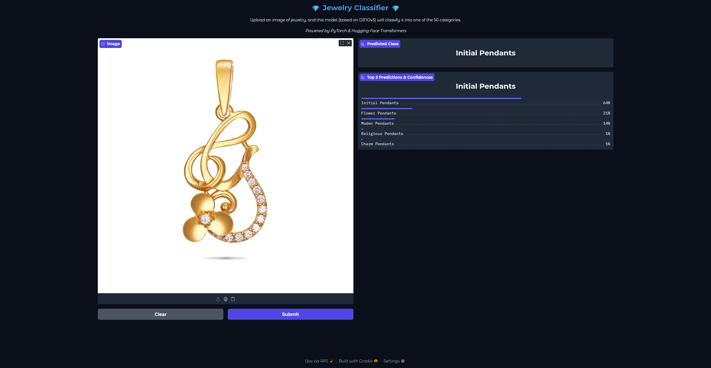
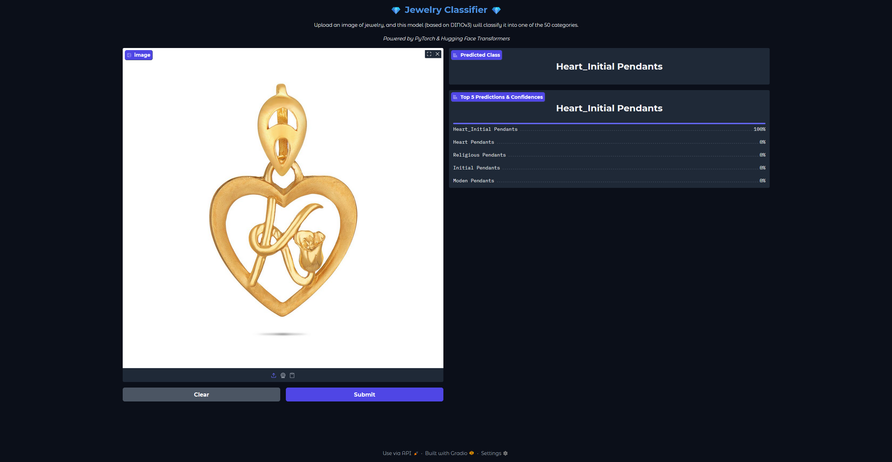
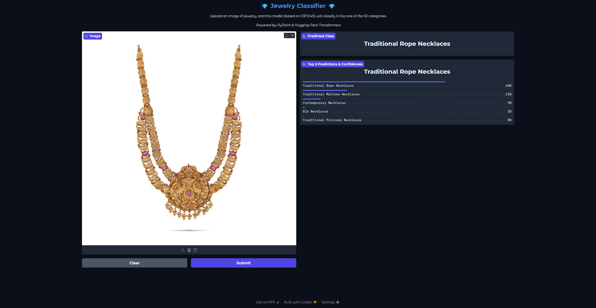
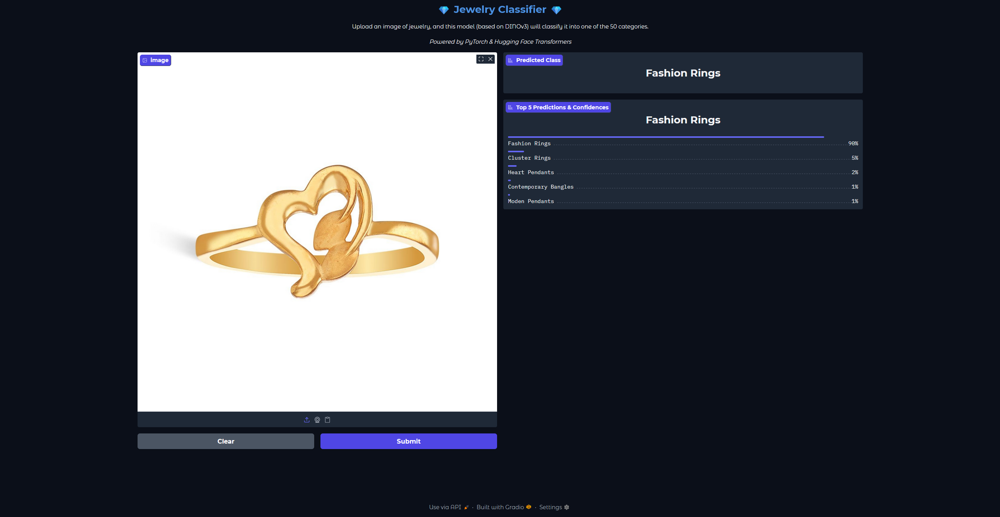

# Jewelry Classifier

This project is a jewelry classifier that can distinguish between different types of jewelry.

## Installation

1. Clone the repository:
   ```bash
   git clone https://github.com/your-username/jewelry-classifier.git
   ```
2. Install the dependencies:
   ```bash
   pip install -r requirements.txt
   ```

## Usage

1. Run the Gradio application:
   ```bash
   python app.py
   ```
2. Open your web browser and go to `http://127.0.0.1:7860`.

## Screenshots

| Screenshot 1 | Screenshot 2 | Screenshot 3                            | Screenshot 4                            |
|---|---|-----------------------------------------|-----------------------------------------|
|  |  |  |  |

## How to Contribute

We welcome contributions to this project. Please follow these steps to contribute:

1. **Fork the repository:** Click the "Fork" button on the top right of the repository page.
2. **Clone your fork:**
   ```bash
   git clone https://github.com/your-username/jewelry-classifier.git
   ```
3. **Create a new branch:**
   ```bash
   git checkout -b feature/your-feature-name
   ```
4. **Make your changes and commit them:**
   ```bash
   git add .
   git commit -m "Add your commit message here"
   ```
5. **Push to your fork:**
   ```bash
   git push origin feature/your-feature-name
   ```
6. **Create a pull request:** Go to the original repository and create a pull request from your forked branch.
